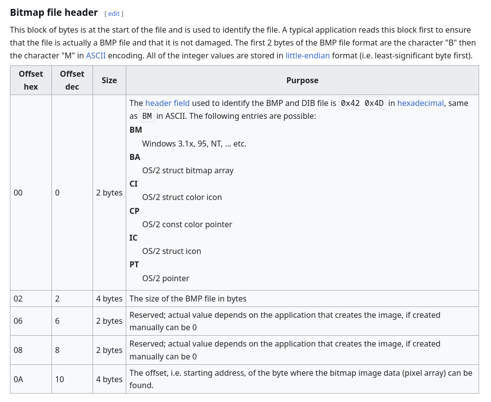
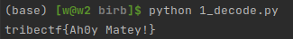

# Birb

We are given all of the files in [problem](./problem).

Our goal is to try to figure out how a secret message has been encoded in the `e2f4c680.bmp` file,
and we'll do that by analyzing the code in `birb.py`!

## Part 1 - The comments always lie

Let's look at what we're given in [birb.py](./problem/birb.py):
```py
#!/usr/bin/env python3
# -*- coding: utf-8 -*-

import math
from hashlib import sha256
import time
import os
import random

message = input('Ahoy matey, enter ye message for the parrot: ')
mBytes = message.encode('utf-8')

# initialize 3D array
pix = int((len(mBytes) / 3 + math.ceil((len(mBytes) / 3) % 1) ))

# get server IP
cPixel = []
pixList = []
for i in range(len(message)):
    ind = i % 3
    match ind:
        case 0:
            if cPixel != []:
                pixList.append(cPixel)
            cPixel = [0, 0, 0]
            cPixel[0] = mBytes[i]
        case 1:
            cPixel[1] = mBytes[i]
        case 2:
            cPixel[2] = mBytes[i]
pixList.append(cPixel)
spAv = 47 * len(mBytes)
if spAv < 512 ** 2 / 2:
    fn = sha256(int(time.time()).to_bytes(8, 'little')).hexdigest()[:8]
    fLen = 54 + 512 ** 2 * 3
    birbs = os.listdir('./birbs')
    with open(('./birbs/' + 'griffin_primary.bmp'), 'rb') as bird:
        bH = bird.read().hex()
        # start kernel, stop it, start it again
        bHex = [bH[i:i+2] for i in range(0, len(bH), 2)]
        with open(fn + '.bmp', 'wb') as outF:
            outF.write(b'BM')
            # Write actual flag
            outF.write(fLen.to_bytes(4, 'little'))
            outF.write(int.to_bytes(0, 4, 'little'))
            outF.write(int.to_bytes(54, 4, 'little'))
            outF.write(int.to_bytes(40, 4, 'little'))
            outF.write(int.to_bytes(512, 4, 'little'))
            outF.write(int.to_bytes(512, 4, 'little'))
            outF.write(int.to_bytes(1, 2, 'little'))
            outF.write(int.to_bytes(24, 2, 'little'))
            outF.write(int.to_bytes(0, 24, 'little'))
            outF.flush()

            point = 54
            # O(n^2) machine learning model
            for pixel in pixList:
                for val in pixel:
                    offset = random.randint(1, 90)
                    outF.write(int.to_bytes(offset, 1, 'little'))
                    outF.flush()

                    # gradient descent
                    outF.write(int.to_bytes(val, 1, 'little'))
                    outF.flush()

                    point += 2
                    # i factor authentication
                    for i in range(offset - 1):
                        outF.write(bytes.fromhex(bHex[point]))
                        point += 1

                    outF.flush()

            # update weights
            outF.write(int.to_bytes(255, 1, 'little'))
            point += 1
            # send data to server file descriptor
            for i in range(len(bHex) - point):
                outF.write(bytes.fromhex(bHex[point]))
                point += 1
            print(fn)
        # end connection to server
        bird.close()
else:
    # print 'too small'
    print('too big')
```

... these comments are worse than useless.
One of the first things we'll want to do is remove them:

```py
#!/usr/bin/env python3
# -*- coding: utf-8 -*-

import math
from hashlib import sha256
import time
import os
import random

message = input('Ahoy matey, enter ye message for the parrot: ')
mBytes = message.encode('utf-8')

pix = int((len(mBytes) / 3 + math.ceil((len(mBytes) / 3) % 1) ))

cPixel = []
pixList = []
for i in range(len(message)):
    ind = i % 3
    match ind:
        case 0:
            if cPixel != []:
                pixList.append(cPixel)
            cPixel = [0, 0, 0]
            cPixel[0] = mBytes[i]
        case 1:
            cPixel[1] = mBytes[i]
        case 2:
            cPixel[2] = mBytes[i]
pixList.append(cPixel)

spAv = 47 * len(mBytes)
if spAv < 512 ** 2 / 2:
    fn = sha256(int(time.time()).to_bytes(8, 'little')).hexdigest()[:8]
    fLen = 54 + 512 ** 2 * 3
    birbs = os.listdir('./birbs')
    with open(('./birbs/' + 'griffin_primary.bmp'), 'rb') as bird:
        bH = bird.read().hex()
        bHex = [bH[i:i+2] for i in range(0, len(bH), 2)]
        with open(fn + '.bmp', 'wb') as outF:
            outF.write(b'BM')
            outF.write(fLen.to_bytes(4, 'little'))
            outF.write(int.to_bytes(0, 4, 'little'))
            outF.write(int.to_bytes(54, 4, 'little'))
            outF.write(int.to_bytes(40, 4, 'little'))
            outF.write(int.to_bytes(512, 4, 'little'))
            outF.write(int.to_bytes(512, 4, 'little'))
            outF.write(int.to_bytes(1, 2, 'little'))
            outF.write(int.to_bytes(24, 2, 'little'))
            outF.write(int.to_bytes(0, 24, 'little'))
            outF.flush()

            point = 54
            for pixel in pixList:
                for val in pixel:
                    offset = random.randint(1, 90)
                    outF.write(int.to_bytes(offset, 1, 'little'))
                    outF.flush()

                    outF.write(int.to_bytes(val, 1, 'little'))
                    outF.flush()

                    point += 2
                    for i in range(offset - 1):
                        outF.write(bytes.fromhex(bHex[point]))
                        point += 1

                    outF.flush()

            outF.write(int.to_bytes(255, 1, 'little'))
            point += 1
            for i in range(len(bHex) - point):
                outF.write(bytes.fromhex(bHex[point]))
                point += 1
            print(fn)
        bird.close()
else:
    print('too big')
```

We can either analyze what's happening here by starting from the input or starting from the output.
Where I ended up is starting with the output, but either way is interchangeable.

Knowing that our output is a file ending with `.bmp`, it looks like the only place that could be generated is here:

```py
...
bHex = [bH[i:i+2] for i in range(0, len(bH), 2)]
with open(fn + '.bmp', 'wb') as outF:
    outF.write(b'BM')
...
```

So, we're trying to find out how `outF` is written (and in particular, how it depends on the data).
It looks like this `with` block contains three sections, let's look further into each.

## Part 2 - Building the Output File

The first things written to `outF` are a number of constant bytes, plus the variable `fLen`:

```py
...
outF.write(b'BM')
outF.write(fLen.to_bytes(4, 'little'))
outF.write(int.to_bytes(0, 4, 'little'))
outF.write(int.to_bytes(54, 4, 'little'))
outF.write(int.to_bytes(40, 4, 'little'))
outF.write(int.to_bytes(512, 4, 'little'))
outF.write(int.to_bytes(512, 4, 'little'))
outF.write(int.to_bytes(1, 2, 'little'))
outF.write(int.to_bytes(24, 2, 'little'))
outF.write(int.to_bytes(0, 24, 'little'))
outF.flush()
...
```

Since we know this is supposed to be a BMP file, we can compare it against the structure that we know BMP file headers must have:

Things get a little complicated after the first few bytes, but Wikipedia fills us in on the important info:



Mapping this information on to our python code, we have:
```py
outF.write(b'BM')                           # Signature bytes, present on all BMP files
outF.write(fLen.to_bytes(4, 'little'))      # Number of total bytes in the BMP
outF.write(int.to_bytes(0, 4, 'little'))    # A reserved field, not meaningful to us
outF.write(int.to_bytes(54, 4, 'little'))   # The location of the first byte of pixel data
...
```

The rest of the header is not particularly important, but adding up the sizes of everything written to the file,
we get a total of `54` bytes.
According to the header we just went through, that means that subsequent bytes will all be read as image data.
Let's keep going.

In the next section, we loop over pixList and write its values, along with some others, to the output file:
```py
...
point = 54
for pixel in pixList:
    for val in pixel:
        offset = random.randint(1, 90)
        outF.write(int.to_bytes(offset, 1, 'little'))
        outF.flush()

        outF.write(int.to_bytes(val, 1, 'little'))
        outF.flush()

        point += 2
        for i in range(offset - 1):
            outF.write(bytes.fromhex(bHex[point]))
            point += 1

        outF.flush()
...
```

For each value in pixList, a random number `offset` is picked and written.

Then, the value in the list is written.

Finally, `offset - 1` bytes from the `bHex` array are written.

`point` here just seems to be keeping track of how many total bytes have been written to the file.

Finally, we have:
```py
outF.write(int.to_bytes(255, 1, 'little'))
point += 1
for i in range(len(bHex) - point):
    outF.write(bytes.fromhex(bHex[point]))
    point += 1
```
A single byte `0xFF` (255) is written to the file,
and then the remaining bytes from the `bHex` array, making sure that the two lengths are equal in the end.

Putting everything together, it seems like our image data will consist mostly of bytes from `bHex`,
with interspersed values from `pixList`,
plus the number of bytes from `bHex` between each of those values.

## Part 3 - Encoding the input

Looking back now in the code, we can see where `pixList` is constructed:

```py
message = input('Ahoy matey, enter ye message for the parrot: ')
mBytes = message.encode('utf-8')

...

cPixel = []
pixList = []
for i in range(len(message)):
    ind = i % 3
    match ind:
        case 0:
            if cPixel != []:
                pixList.append(cPixel)
            cPixel = [0, 0, 0]
            cPixel[0] = mBytes[i]
        case 1:
            cPixel[1] = mBytes[i]
        case 2:
            cPixel[2] = mBytes[i]
pixList.append(cPixel)
```

There are some shenanigans with adding values to a subarray,
but we already know from analyzing the output code that this doesn't matter:
bytes end up being taken one-by-one from `pixList`.
The effect of this is that `pixList` is just going to contain the `utf-8`-encoded bytes of the original message.

## Part 4 - Decoding

Putting all of this together, our goal is now clear:
the message can be extracted if we work through the pixel data from the file,
skip the right number of bytes to avoid all of the noise from `bHex`,
and put together all of the bytes in-between.

A simple script to do this operation is given as [1_decode.py](./1_decode.py):
```py
message = []

with open("problem/e2f4c680.bmp", 'rb') as file:
    # Skip the header
    file.seek(54)

    while True:
        # Read the `offset` value (number of bytes of noise printed after the byte from the message)
        offset = int.from_bytes(file.read(1), 'little')

        if offset == 255:
            break

        # Read the byte from the message
        val = int.from_bytes(file.read(1), 'little')
        message.append(val)

        # Skip the `offset - 1` bytes of noise
        file.read(offset - 1)

# Print the message as UTF-8
print(bytes(message).decode('utf-8'))
```

Running this code, we get:


And there's our key! Pwned/QED
