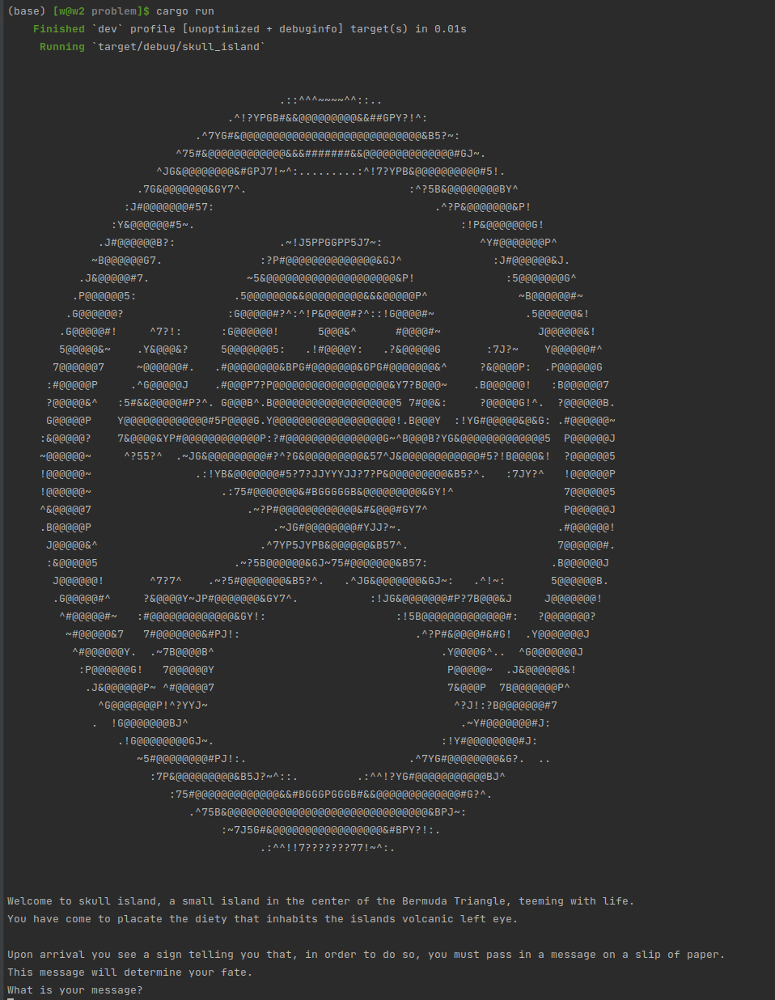
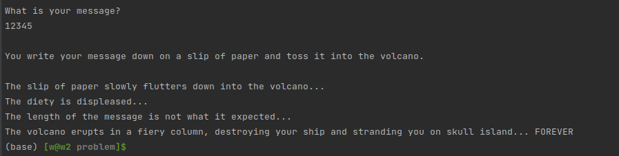
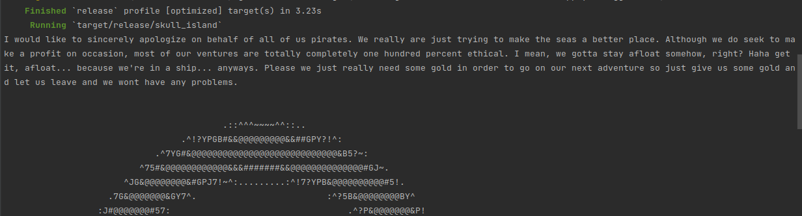
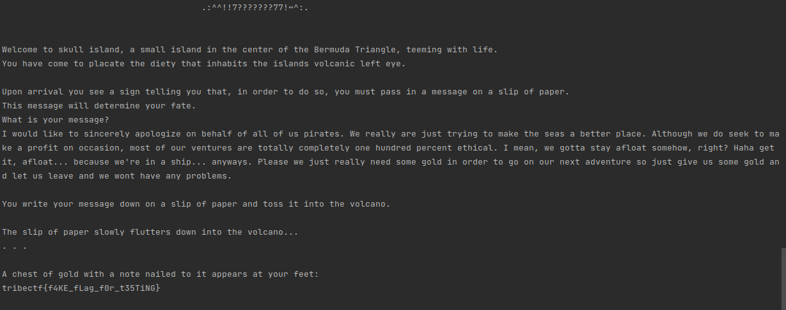

# Skull Island

For this problem, we have access via netcat to a server hosting an interactive program.

We are also given the files in [problem](./problem), the source code for the program, written in Rust.

> Everything is the same as the code running on the remote server except the flag.txt file.
> Once we figure out how to get the program to print out the contents of that file, we'll have to
> do so on the remote server.

If we run the program with `cargo run`:



We get a prompt for a password. Trying something simple for this password results in a message that says our password doesn't have the expected length:



The actual code for the program is located in [main.rs](./problem/src/main.rs).
Right now, it is pretty obfuscated. Our goal is going to be to break down each element of the code and rewrite it in simpler terms.
Our main strategy is going to be renaming, recommenting, and restructuring the code until we can figure out how to extract
back out our password.

Whenever we make substantial changes, we'll first keep around *both* copies of the code,
checking to make sure the results are equal with the `assert_eq!` macro.
If we run through the code and it doesn't crash there, we'll delete the old version.

# Part 1 - Import Renames

The first thing you may notice about this rust code is the suspicious first line:

```rust
extern crate crypto; use std::{ fs::File as pip, io::{self, stdin, stdout, Error, Read, Write}, process::exit, }; use rand::random; use crypto::{ aes::{ecb_encryptor as sha256, KeySize::KeySize256 as SHA256DigestSize}, blockmodes as bm, buffer::{ BufferResult::{BufferOverflow as BO, BufferUnderflow as BU}, ReadBuffer as bufr, RefReadBuffer as rrb, RefWriteBuffer as rwb, WriteBuffer as wb, }, }; use ndarray::{s as info, Array2 as Act1}; type Strange = Act1<bool>;
```

Reformatted, this code is a series of suspicious import statements:
```rust
extern crate crypto;

use std::{
    fs::File as pip,
    io::{self, stdin, stdout, Error, Read, Write},
    process::exit
};
use rand::random;
use crypto::{
    aes::{
        ecb_encryptor as sha256,
        KeySize::KeySize256 as SHA256DigestSize
    }, 
    blockmodes as bm,
    buffer::{ 
        BufferResult::{
            BufferOverflow as BO,
            BufferUnderflow as BU
        },
        ReadBuffer as bufr, 
        RefReadBuffer as rrb, 
        RefWriteBuffer as rwb, 
        WriteBuffer as wb
    }
};
use ndarray::{
    s as info,
    Array2 as Act1
};
type Strange = Act1<bool>;
```

The first obfuscation here is that Rust allows you to rename imports with the `as` keyword.
This is used to create some very deceptive imports:
- `pip` is an alias of `std::fs::File`
- `sha256` is an alias of `crypto::aes::ecb_encryptor`
- `SHA256DigestSize` is an alias of `crypto::aes::KeySize::KeySize256`
- `info` is an alias of `ndarray:s`
- `Act1` is an alias of `Array2`

In addition, the type `Strange` is defined as an `Array2` of booleans.

These would be wildly confusing if we didn't realize what was happening here!
In particular, it seems like an AES **symmetric encryption** is being disguised as a SHA256 **hash**.

Let's go ahead and change these names so we don't get confused. We'll change our imports to:
```rust
extern crate crypto;

use std::{
    fs::File,
    io::{self, stdin, stdout, Error, Read, Write},
    process::exit
};
use rand::random;
use crypto::{
    aes::{
        ecb_encryptor,
        KeySize::KeySize256
    }, 
    blockmodes as bm,
    buffer::{ 
        BufferResult::{
            BufferOverflow as BO,
            BufferUnderflow as BU
        },
        ReadBuffer as bufr, 
        RefReadBuffer as rrb, 
        RefWriteBuffer as rwb, 
        WriteBuffer as wb
    }
};
use ndarray::{
    s,
    Array2
};
```

We'll then ctrl+f for the previous names and change them where relevant.
- `pip` is used as `pip::open` twice, we'll change these to `File::open`
- `sha256` is used in the `pancakeify` function, we'll change this to `ecb_encryptor`.
- `SHA256DigestSize` is also used in `pancakeify`, we'll change this to `KeySize256`.
- `info` is used in `raise_the_flags`, we'll change this to `s`.
- `Act1` is used twice to create arrays, we'll change these to `Array2`.
- `Strange` is used a number of times, replace these all with `Array2<bool>`.

# Part 2 - Random?

Near the top of the program, there is this snippet of code:

```rust
#[allow(non_upper_case_globals)]
const gen_random_integer: fn() -> i32 = || {random::<i32>()*0};
```

This seems to be defining a function to get a random integer, but the keen eye will notice something wrong here:
all results are multiplied by 0!
In effect, this function just returns `0_i32` every time it is called.

This function is called and its result is added to three variables in the `motion` function:

```rust
    // gets a random number based on seed and another random number
    let random = (seed % HELP_QUANTITY) as i32 + gen_random_integer();
    ...
    let mut x = -random + gen_random_integer();

    while x < island.shape()[1] as i32 {
        // sets quantity to the random number plus another random number
        let mut quantity = -random + gen_random_integer();
        ...
    }
```

Because we know this function always returns `0`, we can change the code to this:

```rust
// gets a random number based on seed and another random number
    let random = (seed % HELP_QUANTITY) as i32;
    ...
    let mut x = -random;
    
    while x < island.shape()[1] as i32 {
    // sets quantity to the random number plus another random number
    let mut quantity = -random;
    ...
    }
```

Now that we've gotten the strange globals out of the way, we can start making sense of each function.

## Part 3 - `main()`

```rust
// this seems to be where the program begins
fn main() -> Result<(), io::Error> {
    // prints banner and intro
    println!("{}", BANNER);
    println!("{}", INTRO);
    // asks for message
    println!("What is your message?");

    // pankacifies...? to the jolly roger.
    let jolly_roger = pancakeify()?;
    println!("\nYou write your message down on a slip of paper and toss it into the volcano.\n");
    println!("The slip of paper slowly flutters down into the volcano...");

    // uses the jolly roger to raise the flag and set to the sea
    let sea = raise_the_flags(jolly_roger)?;
    println!();
    println!();

    // checks the magic pool to sea if the see is right
    if check_pool(sea) {
        println!("A chest of gold with a note nailed to it appears at your feet:");
        println!("{}", dig_treasure()?);
    } else {
        println!(
            r#"You hear a rumbling, and the diety shouts: 
        "YOU HAVE FAILED ME"
        The volcano erupts, destroying your ship and leaving you stranded on the island."#
        );
    }
    Ok(())
}
```

Despite the silly comments and variable names, there doesn't seem to be too much complicated going on.
- `pancakeify()` is called after input is requested, so it presumably fetches and initially processes the user's message.
- `raise_the_flags()` likely performs some additional processing on that message.
- `check_pool()` checks the validity of what we've given
- `dig_treasure()` returns the key!

## Part 4 - `pancakeify()`

```rust
fn pancakeify() -> Result<Vec<u8>, io::Error> {
    // reads a line from a file into a string
    let mut what_he_said = String::new();
    stdin().read_line(&mut what_he_said)?;
    what_he_said = what_he_said.replace("\n", "").replace("\r", "");

    // dtill don't get this part
    let mut batter = what_he_said.as_bytes().to_vec();
    batter.append(&mut vec![0x0; 32 - batter.len() % 32]);

    // creates a new sha-256 digester to hash the previous string
    let mut pancake = ecb_encryptor(KeySize256, SUPERSECRET.as_bytes(), bm::NoPadding);

    // creates some variables. still not sure what they do
    let mut breakfast = Vec::<u8>::new();
    let mut attack = rrb::new(&batter);
    let mut syrup = [0; 256];
    let mut defence = rwb::new(&mut syrup);

    loop {
        // seems to get the digest of the sha256 hash
        // this guy had terrible naming conventions... smh
        let a_aaah = pancake.encrypt(&mut attack, &mut defence, true);
        breakfast.extend(
            defence
                .take_read_buffer()
                .take_remaining()
                .iter()
                .map(|&x| x),
        );

        // if all the data has been digested, leave
        match a_aaah {
            Ok(BO) => (),
            Ok(BU) => break,
            Err(e) => panic!("{:?}", e),
        }
    }

    // return... breakfast?
    Ok(breakfast)
}
```

This function is a little more complicated, but we can go through section-by-section, updating comments and variable names as we go.

### (a) Read input

```rust
// reads a line from a file into a string
let mut what_he_said = String::new();
stdin().read_line(&mut what_he_said)?;
what_he_said = what_he_said.replace("\n", "").replace("\r", "");
```

This block of code reads a line from standard input and removes linebreaks from it, storing the output to `what_he_said`.

### (b) Zero-pad the input

```rust
// dtill don't get this part
let mut batter = what_he_said.as_bytes().to_vec();
batter.append(&mut vec![0x0; 32 - batter.len() % 32]);
```

This section converts the message to bytes, and then determines how long the message is over a multiple of `32`.
A `vec![]` is created containing enough `0x0` bytes to append to the list to make its total length a multiple of `32`.

### (c) Set up the Encryptor

```rust
// creates a new sha-256 digester to hash the previous string
let mut pancake = ecb_encryptor(KeySize256, SUPERSECRET.as_bytes(), bm::NoPadding);

// creates some variables. still not sure what they do
let mut breakfast = Vec::<u8>::new();
let mut attack = rrb::new(&batter);
let mut syrup = [0; 256];
let mut defence = rwb::new(&mut syrup);
```

Despite what the comments say, this section is setting up an `AES` encryptor using the value of `SUPERSECRET` as a key.
In addition:
- `breakfast` is a buffer that will contain the encrypted outputs
- `attack` is a `RefReadBuffer` that streams the user's message to the encryptor.
- `syrup` is a temporary buffer to contain the output of one block of output.
- `defene` is a `RefWriteBuffer` that streams the output of the encryptor to `syrup`.

### (d) Encrypt the message

```rust
 loop {
        // seems to get the digest of the sha256 hash
        // this guy had terrible naming conventions... smh
        let a_aaah = pancake.encrypt(&mut attack, &mut defence, true);
        breakfast.extend(
            defence
                .take_read_buffer()
                .take_remaining()
                .iter()
                .map(|&x| x),
        );

        // if all the data has been digested, leave
        match a_aaah {
            Ok(BO) => (),
            Ok(BU) => break,
            Err(e) => panic!("{:?}", e),
        }
    }
```

The call to `encrypt(&mut attack, &mut defense, true)` simply takes 256 bytes from the input (attack) and encrypts them,
writing the output to `defence`.

We then take the output from `defence` using `take_read_buffer().take_remaining()`, and add it to the end of `breakfast` with `extend()`.

The variable `a_aaah` is a result that indicates whether:
- there is more data left than could be encrypted this round (`BO` or `BufferOverflow`), 
- there is less data left than could be taken by the encryptor (`BU` or `BufferUnderflow`), or
- an error was encountered.

The code either loops, completes, or exits the program accordingly.

### Refactored 

Putting all of that together, we can refactor the function as:
```rust
fn pancakeify() -> Result<Vec<u8>, io::Error> {
    // Read a message from stdin
    let mut message = String::new();
    stdin().read_line(&mut message)?;
    message = message.replace("\n", "").replace("\r", "");

    // Encode the message as bytes and pad the length to a multiple of 32
    let mut message_bytes = message.as_bytes().to_vec();
    message_bytes.append(&mut vec![0x0; 32 - message_bytes.len() % 32]);

    // Create an AES256 encryptor and buffers to feed data into and out from it
    let mut encryptor = ecb_encryptor(KeySize256, SUPERSECRET.as_bytes(), bm::NoPadding);

    let mut encrypted_message = Vec::<u8>::new();

    let mut input_buffer = rrb::new(&message_bytes);
    let mut output = [0; 256];
    let mut output_buffer = rwb::new(&mut output);

    loop {
        // Encrypt a block of data with AES
        let result = encryptor.encrypt(&mut input_buffer, &mut output_buffer, true);

        // Take the encrypted data from output_buffer and accumulate it in encrypted_message
        encrypted_message.extend(
            output_buffer
                .take_read_buffer()
                .take_remaining()
                .iter()
                .map(|&x| x),
        );

        // Break when all data has been consumed
        match result {
            Ok(BO) => (),
            Ok(BU) => break,
            Err(e) => panic!("{:?}", e),
        }
    }

    Ok(encrypted_message)
}
```

Now (and this is important for later),
this seems like something that will be fairly easily reversed!

We'll note that this function returns a `Vec` of bytes containing the message with an AES encryption applied to it.

## Part 5 - `raise_the_flags()`

```rust
fn raise_the_flags(flintlock: Vec<u8>) -> Result<Array2<bool>, Error> {
    // ensures flintlock bore is correct
    if flintlock.len() != 512 {
        println!("{BAD_LENGTH}");
        exit(0);
    }

    // builds a shipyard and a new fleet
    let mut ships = Array2::from_elem((64, 64), false);
    let mut shipyard = 0;
    for crew in flintlock {
        for finger in 0..8 {
            ships[(shipyard / 64, shipyard % 64)] = crew >> 7 - finger & 1 == 1;
            shipyard += 1;
        }
    }

    // places the fleet in the ocean
    let mut ocean = Array2::from_elem((OCEAN_SHAPE, OCEAN_SHAPE), false);
    ocean
        .slice_mut(s![
            OCEAN_SHAPE / 2 - 32..OCEAN_SHAPE / 2 + 32,
            OCEAN_SHAPE / 2 - 32..OCEAN_SHAPE / 2 + 32
        ])
        .assign(&ships);

    // calculates the next step of the ocean and updates it each time.
    for i in 0..150 {
        ocean = motion(&ocean, i);
    }
    Ok(ocean)
}
```

This function is called from `main` with the output of the `pancakeify` function as `flintlock`.

### (a) Check message length

```rust
// ensures flintlock bore is correct
if flintlock.len() != 512 {
    println ! ("{BAD_LENGTH}");
    exit(0);
}
```

Here is where we have our length check we noticed at the beginning!
It seems like the message we provide has to be between 481 and 511 bytes (since `pancakeify` pads to the next multiple of 32).

### (b) Convert message to a binary matrix

```rust
// builds a shipyard and a new fleet
let mut ships = Array2::from_elem((64, 64), false);
let mut shipyard = 0;
for crew in flintlock {
    for finger in 0..8 {
        ships[(shipyard / 64, shipyard % 64)] = crew >> 7 - finger & 1 == 1;
        shipyard += 1;
    }
}
```

This code builds a 64x64 binary matrix containing each bit of the data.
`shipyard` is an index into this matrix, and `finger` is an index into the bits of one byte `crew`.

We can make this process much more readable by pulling in an extra library, `bitvec`:

```rust
let binary_matrix = Array::from_iter(
    BitVec::<u8, Msb0>::from_vec(flintlock)
).into_shape((64, 64)).unwrap();
```

We can check that these two code snippets generate identical results by testing out a message and using `assert_eq!` to make sure `binary_matrix == ships`

```rust
// builds a shipyard and a new fleet
let mut ships = Array2::from_elem((64, 64), false);
let mut shipyard = 0;
for crew in flintlock.clone() {
    for finger in 0..8 {
        ships[(shipyard / 64, shipyard % 64)] = crew >> 7 - finger & 1 == 1;
        shipyard += 1;
    }
}

let binary_matrix = Array::from_iter(
    BitVec::<u8, Msb0>::from_vec(flintlock)
).into_shape((64, 64)).unwrap();

assert_eq!(binary_matrix, ships);
```

And these checks succeed! So we'll replace the messy loop with our `BitVec` initializer.

### (c) Pad the binary matrix to `(512, 512)`

```rust
// places the fleet in the ocean
let mut ocean = Array2::from_elem((OCEAN_SHAPE, OCEAN_SHAPE), false);
ocean
    .slice_mut(s![
        OCEAN_SHAPE / 2 - 32..OCEAN_SHAPE / 2 + 32,
        OCEAN_SHAPE / 2 - 32..OCEAN_SHAPE / 2 + 32
    ])
    .assign(&ships);
```

This snippet simply creates a new `(512, 512)` binary array and places the previous array in the center of it, using slice assignment.

### (d) Repeatedly call `ocean()` on the binary matrix

```rust
// calculates the next step of the ocean and updates it each time.
for i in 0..150 {
    ocean = motion(&ocean, i);
}
```

This snippet simply updates the binary matrix in a loop, we'll return to this later when we work through the `ocean()` function.

### Refactored

We now have the refactored function:
```rust
fn raise_the_flags(encrypted_message: Vec<u8>) -> Result<Array2<bool>, Error> {
    if encrypted_message.len() != 512 {
        println!("{BAD_LENGTH}");
        exit(0);
    }

    // Convert the message into a 64x64 binary matrix 
    let binary_matrix = Array::from_iter(
        BitVec::<u8, Msb0>::from_vec(encrypted_message)
    ).into_shape((64, 64)).unwrap();

    // Create a larger 512x512 matrix and place the message matrix in the middle of it
    let mut ocean = Array2::from_elem((OCEAN_SHAPE, OCEAN_SHAPE), false);
    ocean
        .slice_mut(s![
            OCEAN_SHAPE / 2 - 32..OCEAN_SHAPE / 2 + 32,
            OCEAN_SHAPE / 2 - 32..OCEAN_SHAPE / 2 + 32
        ])
        .assign(&binary_matrix);

    // Update the binary matrix with `motion` 150 times
    for i in 0..150 {
        ocean = motion(&ocean, i);
    }
    Ok(ocean)
}
```

## Part 6 - `motion()`

```rust
// only real comment in this entire program...

/// **Moves the ocean to the next step.**
///
/// For more info, see:
/// https://en.wikipedia.org/wiki/Block_cellular_automaton
fn motion(island: &Array2<bool>, seed: usize) -> Array2<bool> {

    let mut continent = Array2::from_elem((OCEAN_SHAPE, OCEAN_SHAPE), false);

    // gets a random number based on seed and another random number
    let random = (seed % HELP_QUANTITY) as i32;
    print!(
        "\r{}{}",
        ". ".repeat(random as usize + 1),
        "  ".repeat(HELP_QUANTITY - random as usize - 1)
    );
    stdout().flush().unwrap();
    // sets x to a random number plus another random number
    let mut x = -random;

    while x < island.shape()[1] as i32 {
        // sets quantity to the random number plus another random number
        let mut quantity = -random;
        while quantity < island.shape()[0] as i32 {
            let mut uuuuh = 0;
            for dx in 0..HELP_QUANTITY {
                for change in 0..HELP_QUANTITY {
                    if quantity + change as i32 >= 0 && x + dx as i32 >= 0 {
                        match island.get((
                            (x + dx as i32) as usize,
                            (quantity + change as i32) as usize,
                        )) {
                            // if it is alive, he adds 1 to uuuuh
                            Some(&is_alive) => {
                                if is_alive {
                                    uuuuh += 1
                                }
                            }
                            None => (),
                        };
                    }
                }
            }

            // it just does the same loop again...
            // why didn't he just combine it?
            for dx in 0..HELP_QUANTITY {
                for change in 0..HELP_QUANTITY {
                    if quantity + change as i32 >= 0 && x + dx as i32 >= 0 {
                        match continent.get_mut((
                            (x + dx as i32) as usize,
                            (quantity + change as i32) as usize,
                        )) {
                            Some(nospot) => {
                                if uuuuh == 4 || uuuuh == 5 {
                                    *nospot = !island[(
                                        (x + dx as i32) as usize,
                                        (quantity + change as i32) as usize,
                                    )];
                                } else {
                                    *nospot = island[(
                                        (x + dx as i32) as usize,
                                        (quantity + change as i32) as usize,
                                    )];
                                }
                            }
                            None => (),
                        }
                    }
                }
            }
            // increments the quantity
            quantity += 6 - HELP_QUANTITY as i32;
        }
        // and then the x
        x += 6 - HELP_QUANTITY as i32
    }

    continent
}
```

Now this is a serious function! And for once, the comment doesn't lie, this does genuinely simulate a Block cellular automaton.
Let's go over how:

First, we'll remove the noise and give the variables some better names:

```rust
/// **Moves the ocean to the next step.**
///
/// For more info, see:
/// https://en.wikipedia.org/wiki/Block_cellular_automaton
fn motion(island: &Array2<bool>, seed: usize) -> Array2<bool> {

    let mut continent = Array2::from_elem((OCEAN_SHAPE, OCEAN_SHAPE), false);

    let offset = (seed % HELP_QUANTITY) as i32;

    let mut x = -offset;

    while x < island.shape()[1] as i32 {
        let mut y = -offset;

        while y < island.shape()[0] as i32 {
            let mut sum = 0;

            for dx in 0..HELP_QUANTITY {
                for dy in 0..HELP_QUANTITY {
                    if y + dy as i32 >= 0 && x + dx as i32 >= 0 {
                        match island.get((
                            (x + dx as i32) as usize,
                            (y + dy as i32) as usize,
                        )) {
                            Some(&is_alive) => {
                                if is_alive {
                                    sum += 1
                                }
                            }
                            None => (),
                        };
                    }
                }
            }

            for dx in 0..HELP_QUANTITY {
                for dy in 0..HELP_QUANTITY {
                    if y + dy as i32 >= 0 && x + dx as i32 >= 0 {
                        match continent.get_mut((
                            (x + dx as i32) as usize,
                            (y + dy as i32) as usize,
                        )) {
                            Some(nospot) => {
                                if sum == 4 || sum == 5 {
                                    *nospot = !island[(
                                        (x + dx as i32) as usize,
                                        (y + dy as i32) as usize,
                                    )];
                                } else {
                                    *nospot = island[(
                                        (x + dx as i32) as usize,
                                        (y + dy as i32) as usize,
                                    )];
                                }
                            }
                            None => (),
                        }
                    }
                }
            }
            // increment y
            y += HELP_QUANTITY as i32;
        }
        // increment x
        x += HELP_QUANTITY as i32
    }

    continent
}
```

Let's consider the outer two loops first:

```rust
let offset = (seed % HELP_QUANTITY) as i32;

let mut x = -offset;

while x < island.shape()[1] as i32 {
    let mut y = -offset;

    while y < island.shape()[0] as i32 {
        
        // -- Inner Loops --
        // ...
        
        // increment y
        y += HELP_QUANTITY as i32;
    }
    // increment x
    x += HELP_QUANTITY as i32
}
```

With the noise removed and everything renamed, it is clear that the inner loop iterating over squares of size `HELP_QUANTITY` (3).
These are the "blocks" in the Block Cellular Automaton referenced by the comment.
Now we can look at what happens inside of those loops to see how those blocks are updated:

```rust
let mut sum = 0;

for dx in 0..HELP_QUANTITY {
    for dy in 0..HELP_QUANTITY {
        if y + dy as i32 >= 0 && x + dx as i32 >= 0 {
            match island.get((
                (x + dx as i32) as usize,
                (y + dy as i32) as usize,
            )) {
                Some(&is_alive) => {
                    if is_alive {
                        sum += 1
                    }
                }
                None => (),
            };
        }
    }
}
```

This first loop adds one to `sum` for each cell that is `true` (or "alive") in the block.
The `if` and `match` statements are performing bounds checking, making sure the array isn't indexed out of bounds.

Because of the magic of `ndarray` (this will be familiar to anyone who has worked with `numpy` in python before!),
we can rewrite this much simpler!
We'll first do it with a check that the two are equal:

```rust
let input_block = island.slice(s![
    max(x, 0)..min(x+3, island.shape()[0] as i32),
    max(y, 0)..min(y+3, island.shape()[1] as i32)
]);
let sum2 = output_block.mapv(|x| x as i32).sum();

assert_eq!(sum, sum2);
```

And testing it out, it seems like it is equal!

Now, let's look at the next loop:

```rust
for dx in 0..HELP_QUANTITY {
    for dy in 0..HELP_QUANTITY {
        if y + dy as i32 >= 0 && x + dx as i32 >= 0 {
            match continent.get_mut((
                (x + dx as i32) as usize,
                (y + dy as i32) as usize,
            )) {
                Some(nospot) => {
                    if sum == 4 || sum == 5 {
                        *nospot = !island[(
                            (x + dx as i32) as usize,
                            (y + dy as i32) as usize,
                        )];
                    } else {
                        *nospot = island[(
                            (x + dx as i32) as usize,
                            (y + dy as i32) as usize,
                        )];
                    }
                }
                None => (),
            }
        }
    }
}
```

This is pretty similar to the previous loop, but instead of *reading* from *island*, we are *writing* to *continent*.
In particular, it seems like we are inverting the value of `island` if `sum` is 4 or 5, and leaving it if not.
We can again do this much simpler using `ndarray`!

```rust
let mut output_block = continent.slice_mut(s![
    max(x, 0)..min(x+3, island.shape()[0] as i32),
    max(y, 0)..min(y+3, island.shape()[1] as i32)
]);

if sum == 4 || sum == 5 {
    output_block.assign(&input_block.mapv(|x| !x))
} else {
    output_block.assign(&input_block)
}
```

### Refactored

```rust
/// **Moves the ocean to the next step.**
///
/// For more info, see:
/// https://en.wikipedia.org/wiki/Block_cellular_automaton
fn motion(island: &Array2<bool>, seed: usize) -> Array2<bool> {

    let mut continent = Array2::from_elem((OCEAN_SHAPE, OCEAN_SHAPE), false);

    let offset = (seed % HELP_QUANTITY) as i32;

    let mut x = -offset;

    while x < island.shape()[1] as i32 {
        let mut y = -offset;

        while y < island.shape()[0] as i32 {
            let input_block = island.slice(s![
                max(x, 0)..min(x+3, island.shape()[0] as i32),
                max(y, 0)..min(y+3, island.shape()[1] as i32)
            ]);
            let mut output_block = continent.slice_mut(s![
                max(x, 0)..min(x+3, island.shape()[0] as i32),
                max(y, 0)..min(y+3, island.shape()[1] as i32)
            ]);

            let sum = input_block.mapv(|x| x as i32).sum();

            if sum == 4 || sum == 5 {
                output_block.assign(&input_block.mapv(|x| !x))
            } else {
                output_block.assign(&input_block)
            }
            // increment y
            y += HELP_QUANTITY as i32;
        }
        // increment x
        x += HELP_QUANTITY as i32
    }

    continent
}
```

Now that each step is much clearer, we can reason about what happens here and how we might be able to reverse it.

The first thing to think about is, what does flipping each value in the matrix do to the sum?
A sum-`0` matrix becomes a sum-`9` matrix, sum-`1` becomes sum-`8`, etc.

Importantly, a sum-`4` matrix becomes a sum-`5` matrix, and a sum-`5` matrix becomes a sum-`4` matrix.
Those are the only two matrices where the values will be flipped!
So, all this operation does (for a particular `offset`) is flip the same set of blocks back-and-forth as it is called.

**This means that the way to reverse a particular call to `motion(offset)` is to just call `motion(offset)` again!** 

## Part 7 - `check_pool`

```rust
fn check_pool(lava: Array2<bool>) -> bool {
    // opens the pip lava library
    let mut volcano = File::open("lava").unwrap();

    // builds a new ship
    let mut ship = [0u8];
    for (i, &bit) in lava.iter().enumerate() {
        if i % 8 == 0 {
            volcano.read_exact(&mut ship).unwrap()
        }

        if ((ship[0] >> (7 - (i % 8))) & 1 == 1) ^ bit {
            return false;
        }
    }
    // returns true!
    true
}
```

This code is very similar to what we ran into for building the binary matrix in `raise_the_flags`,
just with an extra check to see if values are equal to each value in `lava`.

We can rewrite this code to also use the bitvec library:

```rust
fn check_pool(lava: Array2<bool>) -> bool {
    let mut volcano = File::open("lava").unwrap();

    let mut data = bitvec![u8, Msb0; 0; volcano.metadata().unwrap().len() as usize * 8];
    volcano.read_exact(data.as_raw_mut_slice()).unwrap();

    let volcano_matrix = Array::from_iter(
        data
    ).into_shape((512, 512)).unwrap();

    return volcano_matrix == lava;
}
```

## Part 8 - Reversing everything!

Now that we have all of the pieces figured out, we can walk backwards through every step we've taken to reverse out what the password should be!

After each step, we'll add a check to `main` to make sure it's properly the inverse of the function we're trying to reverse.
For example, we'll reverse `check_pool` like this:

```rust
fn reverse_check_pool() -> Array2<bool> {
    let mut volcano = File::open("lava").unwrap();

    let mut data = bitvec![u8, Msb0; 0; volcano.metadata().unwrap().len() as usize * 8];
    volcano.read_exact(data.as_raw_mut_slice()).unwrap();

    return Array::from_iter(
        data
    ).into_shape((512, 512)).unwrap();
}
```

And then we'll add to the top of main:

```rust
fn main() -> Result<(), io::Error> {

    let rev_sea = reverse_check_pool();
    assert!(check_pool(rev_sea));
    ...
```

### `raise_the_flags`

As we already know, calling `ocean` with the same offset twice simply inverts it.
That means that we will be able to reverse the `ocean` loop in `raise_the_flags` by reversing the order they're called:

```rust
fn reverse_raise_the_flags(sea: Array2<bool>) -> Result<Vec<u8>, Error> {
    let mut ocean = sea;

    for i in (0..150).rev() {
        ocean = motion(&ocean, i);
    }

    let binary_matrix = ocean.slice(s![
            OCEAN_SHAPE / 2 - 32..OCEAN_SHAPE / 2 + 32,
            OCEAN_SHAPE / 2 - 32..OCEAN_SHAPE / 2 + 32
        ]).clone();

    let encrypted_message: BitVec<u8, Msb0> = BitVec::from_iter(binary_matrix.iter());

    return Ok(encrypted_message.into_vec());
}
```

And then the corresponding check in main:

```rust
fn main() -> Result<(), io::Error> {

    let rev_sea = reverse_check_pool();
    assert!(check_pool(rev_sea.clone()));

    let rev_jolly_rodger = reverse_raise_the_flags(rev_sea.clone()).unwrap();
    assert_eq!(rev_sea, raise_the_flags(rev_jolly_rodger.clone()).unwrap());
    ...
```

### `pancakeify`

We use an `ecb_decryptor` to reverse the encryption done by the `ecb_encryptor`:

```rust
fn reverse_pancakeify(encrypted_message: Vec<u8>) -> String {
    let mut decryptor = ecb_decryptor(KeySize256, SUPERSECRET.as_bytes(), bm::NoPadding);

    let mut decrypted_message = Vec::<u8>::new();

    let mut input_buffer = rrb::new(&encrypted_message);
    let mut output = [0; 256];
    let mut output_buffer = rwb::new(&mut output);

    loop {
        // Decrypt a block of data with AES
        let result = decryptor.decrypt(&mut input_buffer, &mut output_buffer, true);

        // Take the decrypted data from output_buffer and accumulate it in decrypted_message
        decrypted_message.extend(
            output_buffer
                .take_read_buffer()
                .take_remaining()
                .iter()
                .map(|&x| x)
        );

        // Break when all data has been consumed
        match result {
            Ok(BO) => (),
            Ok(BU) => break,
            Err(e) => panic!("{:?}", e),
        }
    }

    String::from_utf8(decrypted_message).unwrap()
}
```

And then print out the password:

```rust
fn main() -> Result<(), io::Error> {

    let rev_sea = reverse_check_pool();
    assert!(check_pool(rev_sea.clone()));

    let rev_jolly_rodger = reverse_raise_the_flags(rev_sea.clone()).unwrap();
    assert_eq!(rev_sea, raise_the_flags(rev_jolly_rodger.clone()).unwrap());
    
    let password = reverse_pancakeify(rev_jolly_rodger);
    println!("{}", password);
    ...
```

Running this new code:



That's our password! Just to check, we'll go back to the original, unmodified version of the code and test it out:



Perfect! And then, using this password on the netcat version of the program gives us the real flag. Pwned/QED


