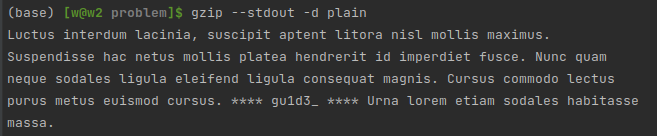
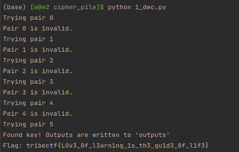

# Cipher Pile

We are given all of the files in [./problem](./problem).

## Part 1 - The expected output

First things first, we have a huge advantage here in knowing what
the data we're expecting is. Let's take a look in a hex dump:


Going back to our trusty wikipedia article of file signatures (https://en.wikipedia.org/wiki/List_of_file_signatures),
we can see that those first two `0x1f8b` bytes mean we're likely dealing with a gzipped file:


Sure enough, it looks like this is a gzipped plaintext document:



## Part 2 - Two-Time Pad/Pad Reuse

When you're given a pair of encoded and decoded data and asked to use it to
decode other documents, you're typically trying to implement a **Two-Time Pad Attack**.

A One-Time Pad is a completely random string that a file is XOR'ed against in order to encrypt it
(https://en.wikipedia.org/wiki/One-time_pad),
but it is called "One-Time" because if it is ever reused, the first time using it can leak information about the second time.

In this case, it seems likely that the problem is that the pad was completely reused for all of the documents we have.
This means that, if we can figure out what encrypted document corresponds with the unencrypted document,
we'll be able to get back the full pad by XORing the two together.

How do we go about this?
This is where the knowledge that each document is a gzipped file comes in handy.
We'll try each one of the possible pairs of plain <-> encrypted, and we'll see if the resulting pad guess
can be used to decrypt the rest of the documents as valid gzip files.

We wrote a python script to perform this operation in [1_dec.py](./1_dec.py):
```py
import gzip
import os

if not os.path.exists("outputs"):
    os.mkdir("outputs")

plain = open("problem/plain", 'rb').read()

# Read in encoded input files
encs = []
for name in range(ord('a'), ord('h') + 1):
    encs.append(open(f"problem/{chr(name)}.enc", 'rb').read())

# Search for the encoded file corresponding with the given plain file
for i in range(len(encs)):
    print("Trying pair", i)

    # Assuming that this pair matches, the encryption pad can be found by XORing the two
    key_attempt = [encs[i][j] ^ plain[j] for j in range(len(encs[i]))]

    # If this pad is correct, applying it to all other encoded files will yield valid gzip streams
    invalid = False
    for j in range(len(encs)):
        decoded = [encs[j][k] ^ key_attempt[k] for k in range(len(key_attempt))]

        try:
            gzipped = gzip.decompress(bytes(decoded))

            f = open(f"outputs/{j}.txt", 'wb')
            f.write(gzipped)
            f.close()
        except:
            print("Pair", i, "is invalid.")
            invalid = True
            break

    # If we found the correct key, stop trying others
    if not invalid:
        print("Found key! Outputs are written to 'outputs'")
        break
```


Success! We now have the plain-text documents (ungzipped) in the `outputs` folder.
They each look something like this:


As it turns out, the flag is divided between all of the files in chunks contained within asterisks.
We make a small addition to our python script to look for those automatically:

```py
...
# Extract the components of the flag from each output
print("Flag: ", end='')

for i in range(len(encs)):
    with open(f"outputs/{i}.txt") as f:
        # The flag is located between asterisks, the only such string in all files
        chunks = [x for x in f.read().split("*") if len(x) > 0]
        print(chunks[1].strip(), end='')

print()
```



And that gives us our flag! Pwned/QED
