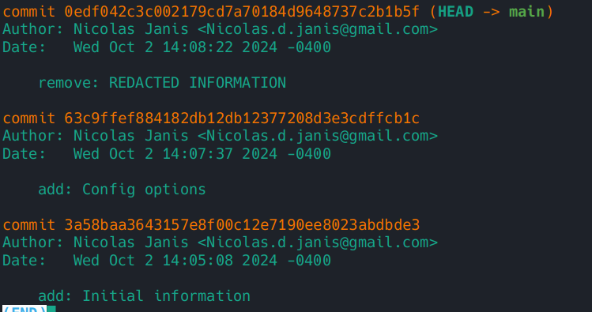
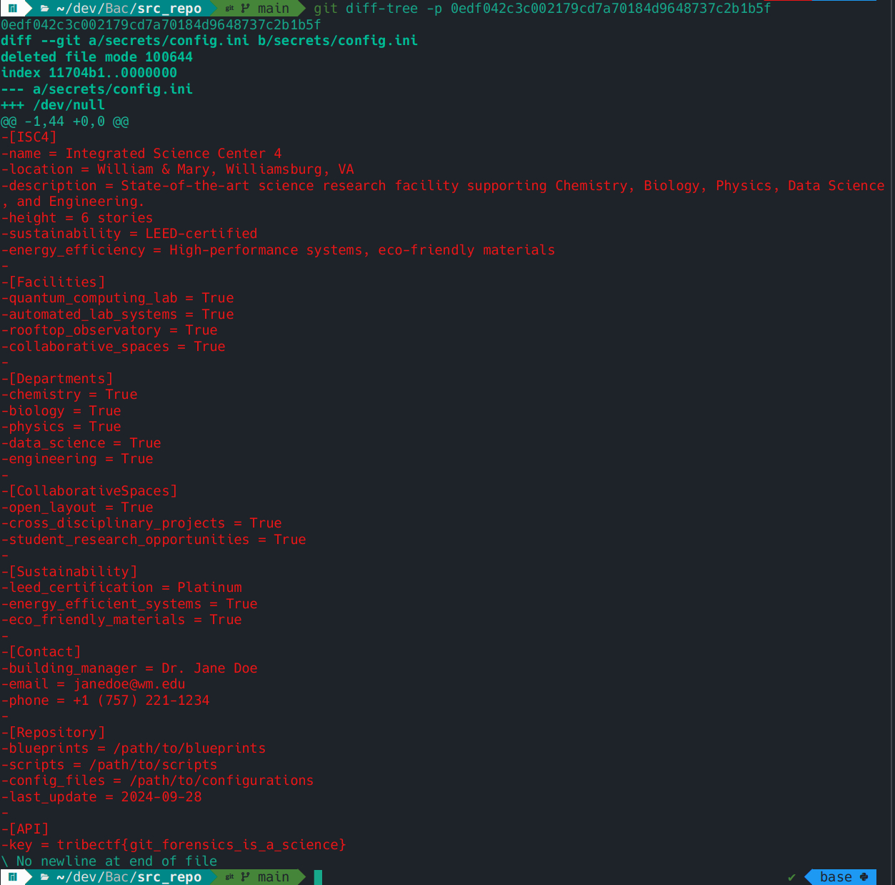

# Back in Time

We are given the Git repository contained in [BackInTime.zip](./BackInTime.zip).

## Solution

If we extract the repository and run `git log` to see the commit history, we can see a suspicious commit titled `remove: REDACTED INFORMATION`.

Simply running `git diff-tree -p 0edf042c3c002179cd7a70184d9648737c2b1b5f` will show us what changed for that commit:

And at the very bottom, we can see that the removed file contained the key! Pwned/QED
