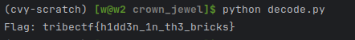

# Crown Jewel

We are given the file [ISC4.png](./ISC4.png).

## Solution

The flag is encoded in the image by replacing the least significant bit in every pixel
with one bit of the data.

We wrote a python script using the `pillow` and `numpy` libraries to extract this information:

[decode.py](./decode.py)

```py
import PIL.Image as Image
import numpy as np

image = Image.open("ISC4.png")
data = np.zeros(shape=(image.width * image.height * 3), dtype=np.bool)

for i in range(image.width * image.height):
    px = image.getpixel((i % image.width, i // image.width))
    data[i*3] = px[0] & 1
    data[i*3 + 1] = px[1] & 1
    data[i*3 + 2] = px[2] & 1

message = np.packbits(data)

# The end of the message is marked by the first 0xff byte
message_end, = np.where(message == 0xff)
message_end = message_end[0]

# Decode the flag is ascii
print("Flag:", bytes(message[:message_end]).decode('ascii'))
```



And the flag is revealed! Pwned/QED
