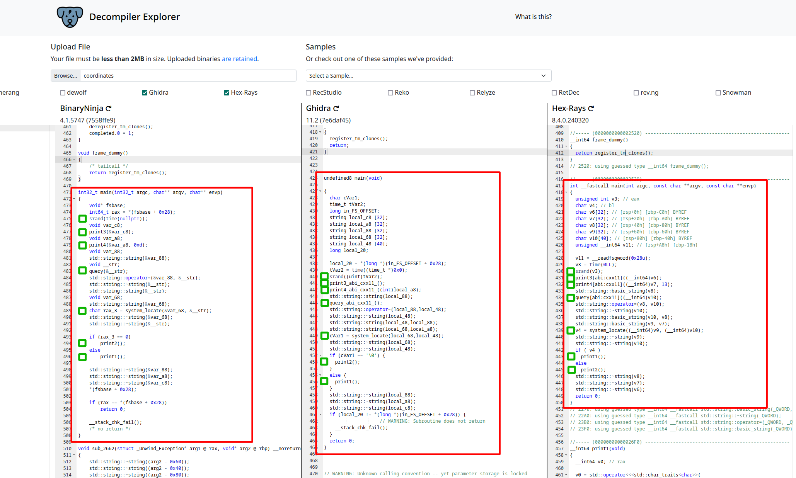
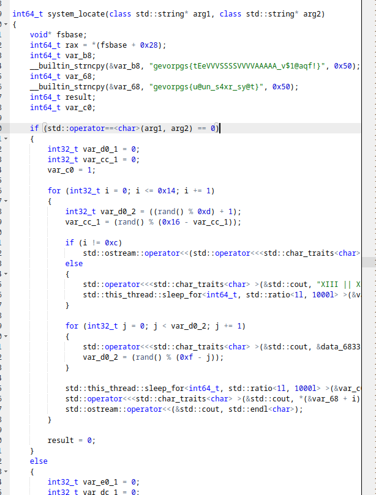
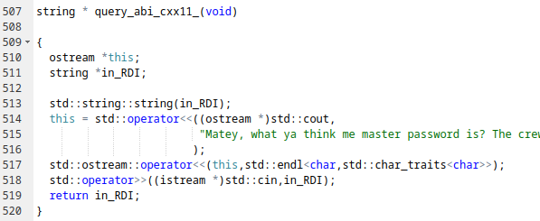
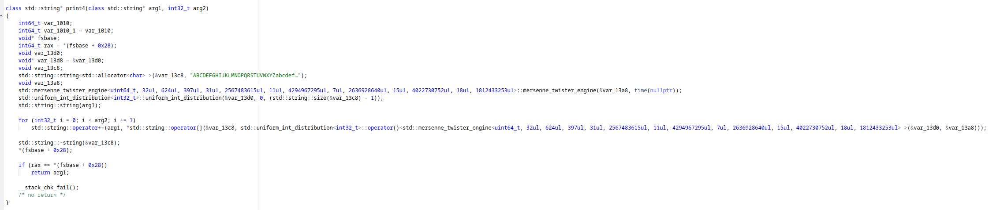
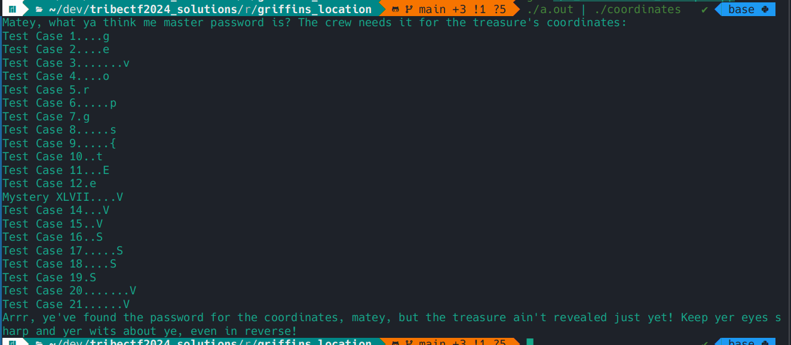

# Griffin's Location

We are given the executable binary (coordinates)[./coordinates] to analyze.

## Part 1 - Program Flow

We start by turning to our favorite online decompiler: https://dogbolt.org/!
This is a really convenient tool, allowing us to see multiple interpretations of the machine code side-by-side.
Let's start by analyzing the `main` function in our binary:



In each output, in-between all of the C++-induced noise, we see the general flow of the program:
1. Seed `rand` with the current time from `time(nullptr)`
2. Call `print3()` with an empty string
3. Call `print4()` with an empty string and the constant `0xd`
4. Call `query()` with an empty string
5. Call `system_locate()` with the strings passed to `print4()` and `query()`
6. Call either `print2()` or `print1()` depending on the return value of `system_locate()`

> Note that the decompilers can be quite deceptive here, and it takes some nuance to see exactly what's being passed around:
> - Ghidra seems completely fooled by the calling conventions of some of the methods, not deducing that they take parameters at all.
> - BinaryNinja misses the critical string copy initializers, making it seem as though `system_locate` can only be passed empty strings
> 
> For this binary `Hex-Rays` seems like it gives the best perspective of the logic involved.

From this, we can deduce that `system_locate()` is some sort of correctness-checking method, processing `print4` and `query`'s outputs.
`print3` could also be important in influencing the predictably-seeded random number generator.
Let's dive deeper into these functions

## Part 2 - Breaking down each component

### `system_locate`

Starting backwards, let's take a glance at the decompilation of `system_locate`.



There are a few important things to note here, but ultimately,
the function seems to compare `arg1` and `arg2` before jumping to more complicated logic.
Operating under the assumption that this function is supposed to check correctness,
it seems like `arg1` and `arg2` must be equal for the checks to succeed.

*Also, there are some very suspiciously-shaped string constants here. Something to keep in mind.*

### `query`

Moving on to the two functions that feed into `system_locate`, the first, `query`, may be the least obfuscated in the program.



This seems to simply be the function to prompt the user for a password and return it as a string literal.
Nothing too fancy going on here.

### `print4`

This one's a dousey!



There seems to be quite a bit going on here, and it's certainly not helped by C++'s verbosity.
Something that helps reduce the clutter is noticing that the long `std::mersenne_twister_engine<...>` definition is equivalent to
the predefined `std::mt19937` from the standard library.
We can also remove the stack protection added by the compiler.

```cpp
class std::string* print4(class std::string* arg1, int32_t arg2)
{
    void var_13d0;
    void var_13c8;
    std::string::string<std::allocator<char> >(&var_13c8, "ABCDEFGHIJKLMNOPQRSTUVWXYZabcdef…");
    void var_13a8;
    std::mt19937(&var_13a8, time(nullptr));
    std::uniform_int_distribution<int32_t>::uniform_int_distribution(&var_13d0, 0, (std::string::size(&var_13c8) - 1));
    std::string::string(arg1);
    
    for (int32_t i = 0; i < arg2; i += 1)
        std::string::operator+=(arg1, *std::string::operator[](&var_13c8, std::uniform_int_distribution<int32_t>::operator()<std::mt19937>(&var_13d0, &var_13a8)));
    
    std::string::~string(&var_13c8);
}
```

Let's clean up the remaining C++ junk and add some descriptive names:
(Also, steal the remainder of the alphabet string from Ghidra, BinaryNinja cuts it off `>:(`)

```cpp
void print4(std::string* arg1, int32_t arg2)
{
    std::string alphabet = "ABCDEFGHIJKLMNOPQRSTUVWXYZabcdefghijklmnopqrstuvwxyz0123456789!@#$%^&*()-_=+[]{}|;:,.<>?/";
    std::mt19937 random_source(time(nullptr));

    std::uniform_int_distribution<> rng(0, alphabet.size() - 1);

    *arg1 = "";
    for (int i = 0; i < arg2; i += 1) {
        *arg1 += alphabet[rng(random_source)];
    }
}
```

All cleaned up, this code is much easier to read, and it can actually be compiled too!
It seems to generate a random string from an alphabet of characters.
Importantly though, this function is **deterministic and predictable depending on the value given by `time(nullptr)`**

This means that the password we need to pass into our query changes once per second.
That's alright though, since now we have a program we can use to generate it!

[coordinates_excerpt.cpp](./1_coordinates_excerpt.cpp) contains a program based on this function that generates the currently active password
and prints it to stdout

## Part 3 - Running the program

Piping the output of our program into `./coordinates` seems to have it accept the password!



You might recognize the letters in each "Test Case" from the magic strings that we saw in `system_locate`.

Unfortunately, at this point, I don't know if there is a way to get the program to print the entirety of the string,
only the first 21 characters of it.
I would love to see if there is a path forward here, but fortunately, we can extract the string directly from the binary.

If the entire string was printed, it would be `gevorpgs{tEeVVVSSSSVVVVAAAAA_v$1@aqf!}`.

Our other hint is that Test Case 13 is replaced with roman numerals.
After investigating, I believe the actual number "XLVII" to be a red herring,
what's important is the **idea of roman numerals** and **the number 13**.

What in cryptography is also roman and used to disguise text?
A Caesar cipher.

Applying a Caesar cipher with a shift of 13, our string of text becomes: `tribectf{gRrIIIFFFFIIIINNNNN_i$1@nds!}`

This is the key for this problem. Pwned/QED
