# Griffin's Treasure

We are given the file `griffin.treausre` with the hint that it may be an executable encrypted in some way

## 1. Analyze the raw file

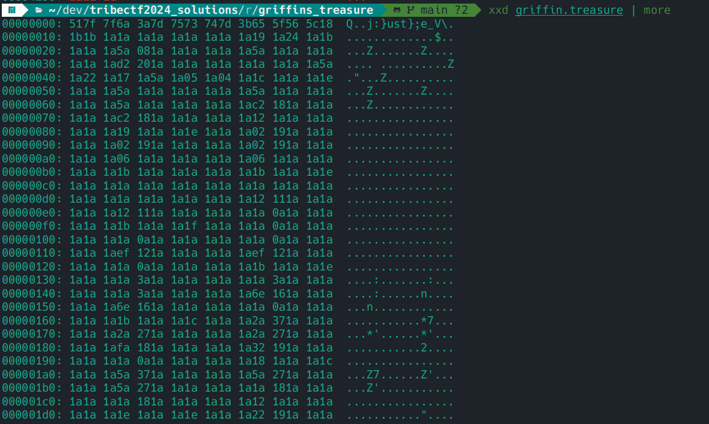

Opening the file in a hex editor reveals no magic header that is well-known, but a suspicious amount of `0x1a` bytes.
Using the knowledge that ELF binaries are encoded with considerable padding of `0x00` bytes
(and with a good amount of trial and error). we guess that the file has been XOR'd with a 1-byte pad of `0x1a`.

A python script is included to decrypt this [1_treasure_decode.py](./1_treasure_decode.py).

## 2. Analyze the decoded binary

Sure enough, the file is a ELF-encoded binary (with a string prepended to it!)

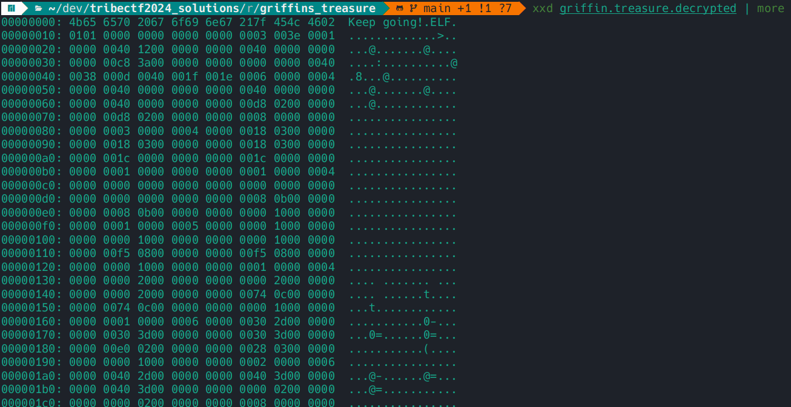

We trim off the message with a second python script [2_treasure_trim.py](./2_treasure_trim.py).

We then can take the binary to a decompiler for further analysis!
For this ctf, I mostly relied on https://dogbolt.org,
a browser tool that decompiles simple binaries with no hassle in configuration and shows you the output of multiple tools side-by-side.

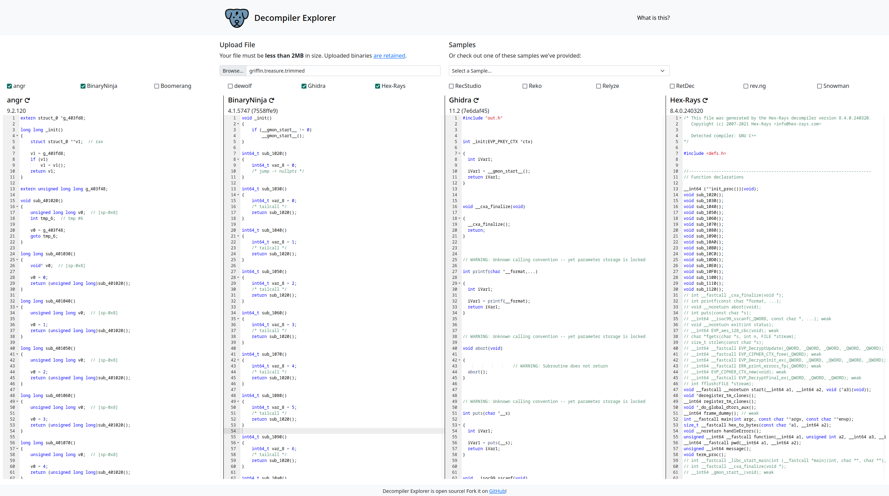

After some searching, it seems like BinaryNinja produces the most readable decompilation of this binary.
We can now see the logic of what's happening in the main function:

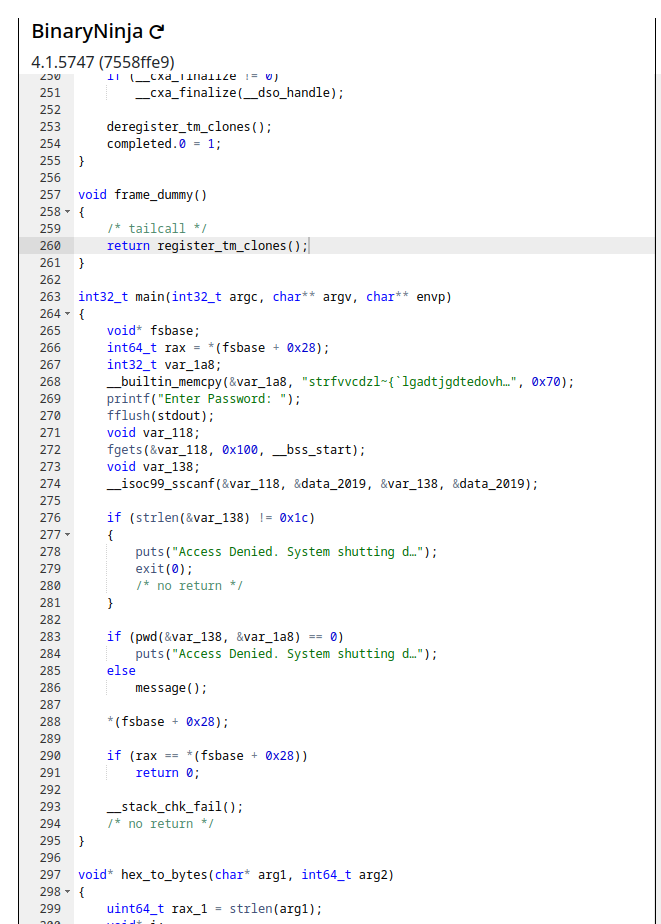

It seems like user input (`var_138`) is verified to be of length `0x1c` (or 28 chars long),
and is then compared against some constant string (`var_1a8`) using a function called `pwd`.

## 3. The `pwd` function

This is the `pwd` function from the same decompilation.

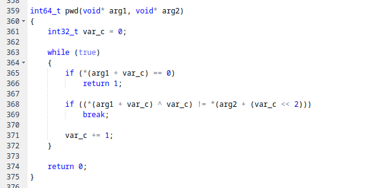

It's definitely not impossible to reverse engineer the algorithm here, but why reinvent the wheel?
The decompiler gave us (almost) valid C code, so we can copy it directly into a c program with some headers imported 
and some types changed.

```c
#include <inttypes.h>
#include <stdio.h>
#include <stdbool.h>

int64_t pwd(char* arg1, char* arg2)
{
    int32_t var_c = 0;

    while (true)
    {
        if (*(arg1 + var_c) == 0)
            return 1;

        if ((*(arg1 + var_c) ^ var_c) != *(arg2 + (var_c << 2)))
            break;

        var_c += 1;
    }

    return 0;
}
```

After some cleaning to match more typical c conventions and
adding useful names by referencing how `pwd` is called in main, we have:

```c
#include <inttypes.h>
#include <stdio.h>
#include <stdbool.h>

int64_t pwd(char* user_input, char* password)
{
    int32_t i = 0;

    while (true)
    {
        if (user_input[i] == 0)
            return 1;

        if (user_input[i] != password[i << 2] ^ i)
            break;

        i += 1;
    }

    return 0;
}
```

Finally, we can remove the `break` that would exit the loop when a character in the password is wrong,
and simply print out what the character should be at each step and call the function with a sufficiently large string and the magic bytes taken from the `Hex-Rays` decompilation:

```c
#include <inttypes.h>
#include <stdio.h>
#include <stdbool.h>

int64_t pwd(char* user_input, char* password)
{
    int32_t i = 0;

    while (true)
    {
        if (user_input[i] == 0)
            return 1;

        printf("%c", password[i << 2] ^ i);
        //if (user_input[i] != password[i << 2] ^ i)
        //    break;

        i += 1;
    }

    return 0;
}

int main() {
    char v4[28];

    v4[0] = 115;
    v4[1] = 116;
    v4[2] = 114;
    v4[3] = 102;
    v4[4] = 118;
    v4[5] = 118;
    v4[6] = 99;
    v4[7] = 100;
    v4[8] = 122;
    v4[9] = 108;
    v4[10] = 126;
    v4[11] = 123;
    v4[12] = 96;
    v4[13] = 108;
    v4[14] = 103;
    v4[15] = 97;
    v4[16] = 100;
    v4[17] = 116;
    v4[18] = 106;
    v4[19] = 103;
    v4[20] = 100;
    v4[21] = 116;
    v4[22] = 101;
    v4[23] = 100;
    v4[24] = 111;
    v4[25] = 118;
    v4[26] = 104;
    v4[27] = 127;
    
    char *demo = "                            \0";

    pwd(demo, v4);
}
```

We run this program and get...

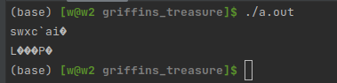

...that doesn't seem right.

## 4. The decompiler lies to you (kind of)

Lets take a look back at the decompiler output to try to figure out where we went wrong:

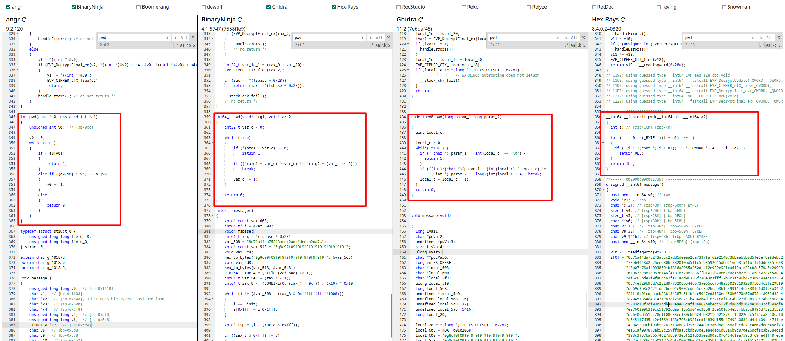

The keen-eyed will notice: the `angr` decompiler gives a subtle, important piece of information:
`pwd` doesn't get passed two `char *` strings, it gets passed a `char *` and an `unsigned int`.

This is the reason why all of the other decompilers have the left shift by 2 (or multiplication by 4)
when indexing the second parameter.
When getting the program to compile, we had to decide on a type to make each parameter,
and 3 out of 4 compilers led us astray by not being able to analyze the data type used.

With this knowledge, let's fix our C code!

```c
#include <inttypes.h>
#include <stdio.h>
#include <stdbool.h>

int64_t pwd(char* user_input, unsigned int* password)
{
    int32_t i = 0;

    while (true)
    {
        if (user_input[i] == 0)
            return 1;

        printf("%c", password[i] ^ i);
        //if (user_input[i] != password[i] ^ i)
        //    break;

        i += 1;
    }

    return 0;
}

int main() {
    unsigned int v4[28];

    v4[0] = 115;
    v4[1] = 116;
    v4[2] = 114;
    v4[3] = 102;
    v4[4] = 118;
    v4[5] = 118;
    v4[6] = 99;
    v4[7] = 100;
    v4[8] = 122;
    v4[9] = 108;
    v4[10] = 126;
    v4[11] = 123;
    v4[12] = 96;
    v4[13] = 108;
    v4[14] = 103;
    v4[15] = 97;
    v4[16] = 100;
    v4[17] = 116;
    v4[18] = 106;
    v4[19] = 103;
    v4[20] = 100;
    v4[21] = 116;
    v4[22] = 101;
    v4[23] = 100;
    v4[24] = 111;
    v4[25] = 118;
    v4[26] = 104;
    v4[27] = 127;

    char *demo = "                            \0";

    pwd(demo, v4);
}
```

This code is given in [3_treasure_excerpt.c](./3_treasure_excerpt.c)

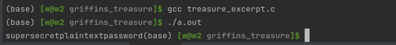

Bingo, our password is `supersecretplaintextpassword`!

# 5. Decypher, decypher, decypher 

Providing our password to the decrypted, trimmed program:

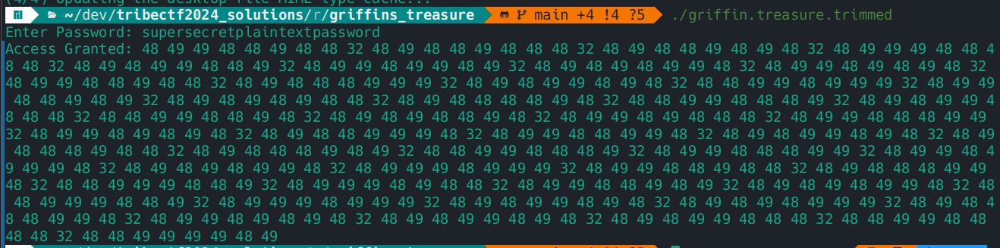

Now we just get to play the same game we did for [Curse of the Wren](../../cryptography/curse_of_the_wren)!

First, we treat the stream of numbers as decimal ascii codepoints:

```py
output = "48 49 49 48 48 49 48 48 32 48 49 48 48 49 48 48 48 32 48 49 48 48 49 48 49 48 32 48 49 49 49 48 48 48 48 32 48 49 48 49 49 48 48 49 32 48 49 49 48 49 49 48 49 32 48 49 48 49 48 49 49 48 32 48 49 49 48 49 48 49 48 32 48 49 49 48 48 49 48 48 32 48 49 48 48 48 49 49 49 32 48 49 48 49 49 48 49 48 32 48 48 49 49 48 49 49 49 32 48 49 49 48 48 49 48 49 32 48 49 48 49 48 49 48 48 32 48 49 48 48 48 48 49 48 32 48 48 49 49 48 48 48 49 32 48 49 48 49 49 48 48 48 32 48 48 49 49 48 48 49 48 32 48 49 48 49 48 48 49 48 32 48 49 49 48 49 48 48 48 32 48 49 49 48 48 48 49 49 32 48 49 49 48 49 48 49 48 32 48 49 48 48 49 49 49 48 32 48 49 49 48 48 49 49 48 32 48 49 48 49 49 48 49 48 32 48 49 48 48 48 49 48 48 32 48 49 48 48 48 49 48 49 32 48 48 49 49 48 48 48 49 32 48 49 49 48 48 48 49 49 32 48 49 49 48 49 49 49 48 32 48 49 48 49 48 49 49 48 32 48 49 49 49 48 49 49 49 32 48 49 49 48 48 49 48 48 32 48 49 48 48 48 49 49 48 32 48 48 49 49 49 48 48 49 32 48 49 49 49 48 49 48 48 32 48 49 49 48 48 49 48 49 32 48 49 48 49 48 49 49 48 32 48 48 49 49 49 48 48 49 32 48 49 49 49 48 49 49 49 32 48 49 48 49 49 48 49 48 32 48 49 48 49 48 49 49 49 32 48 49 48 48 48 49 49 48 32 48 49 49 48 49 48 49 48 32 48 49 48 49 49 48 49 48 32 48 49 48 49 49 48 48 48 32 48 48 49 49 48 48 48 48 32 48 48 49 49 49 49 48 49"
data0 = [int(x) for x in output.split()]
print("Round 0:", data0)

# Round 1: String of decimals encoding ASCII text
data1 = bytes(data0).decode('ascii')
print("Round 1:", data1)
```

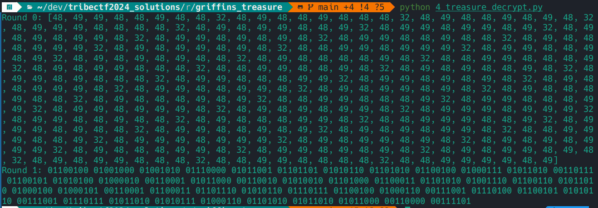

We can see that we now have a stream of binary, decode that as ascii too!

```py
...

# Round 2: String of binary octets separated by spaces encoding ASCII text
data2 = [int(x, 2) for x in data1.split()]
data2 = bytes(data2).decode('ascii')
print("Round 2:", data2)
```

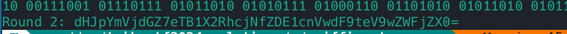

This looks like base64, we're getting close now!

```py
...
# Round 3: Base64-encoded ASCII text
data3 = base64.b64decode(data2).decode('ascii')
print("Round 3:", data3)
```

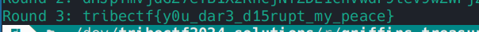

And there we have our key! Pwned/QED. The complete code for the final decryption is available in [4_treasure_decrypt.py](./4_treasure_decrypt.py)

