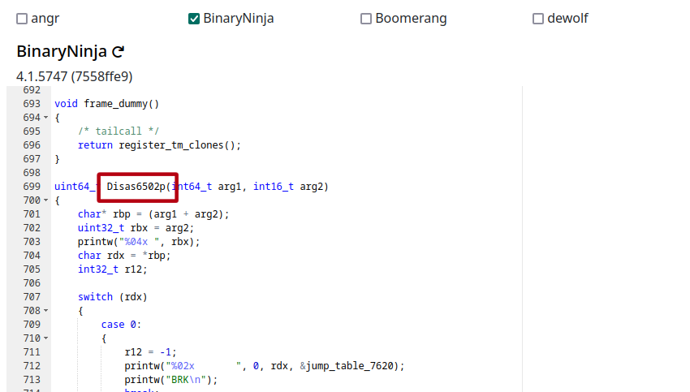
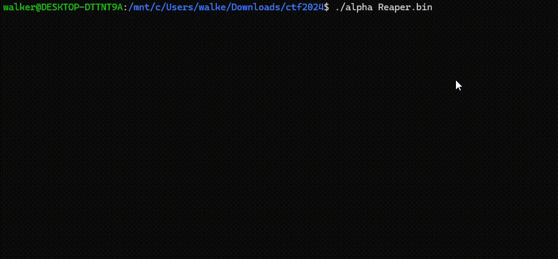
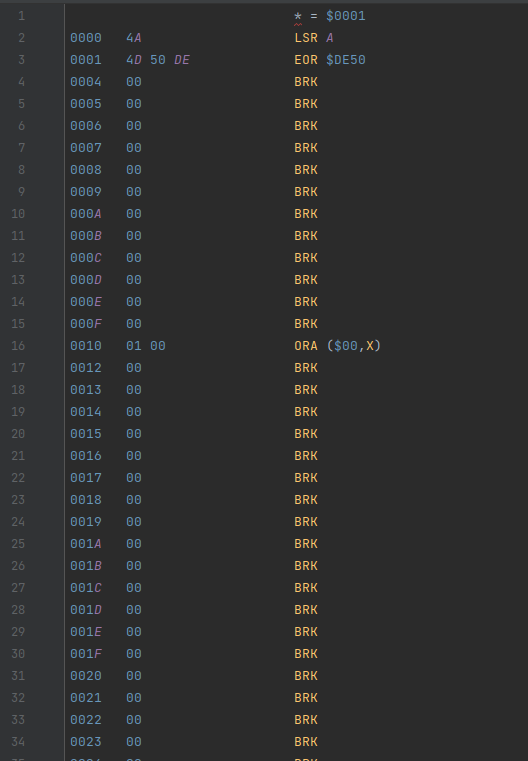
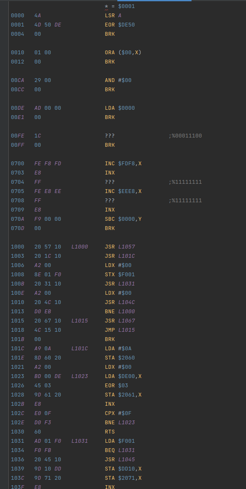
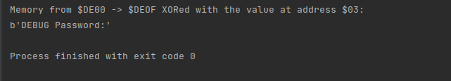

# Old School

We are given the files `alpha` and `Reaper.bin`.

## Part 1 - The Emulator

From some cursory analysis, `alpha` seems to be a typical ELF-format binary.
Opening it up in https://dogbolt.org/, we see:



From some further analysis, `alpha` seems to be a `6502` assembly language emulator!
We pass it a file containing the initial state of memory to set up.

By the process of elimination, that file is probably `Reaper.bin`. Let's try it out:



Nice! Seems like `Reaper.bin` probably contains some small program that requires us to provide a password,
which we'll give to access the key.

## Part 2 - The ROM

With some blind faith that the `Reaper.bin` ROM file likely contains 6502 instructions,
we try to disassemble it with an online 6502 disassembler
(https://www.masswerk.at/ZZZZZZZ6502/disassembler.html).

That gives us a LONG stream of instructions that look like this:

[1_Reaper_dissassembled.asm](./1_Reaper_dissassembled.asm)



We see that most of the file consists of `0x00`, which corresponds to the 6502 `BRK` instruction.
Let's write a brief python program to squash duplicate instructions together:

[2_cleaner.py](./2_cleaner.py)
```py
with open("./1_Reaper_dissassembled.asm") as f:
    with open("./3_Reaper_clean.asm", "w") as f2:

        last_line = None
        gap_written = False

        for line in f.readlines():
            if last_line is None or len(line.split()) < 2 or len(last_line.split()) < 2 or last_line.split()[2:] != line.split()[2:]:
                f2.write(line)
                gap_written = False
            else:
                if not gap_written:
                    f2.write("\n")
                    gap_written = True

            last_line = line
```

This gives us an output that's much more readable:

[3_Reaper_clean.asm](./3_Reaper_clean.asm)



It looks like the disassembler didn't find much before `0x1000`, a lot of `0x00`s and invalid instructions
(signaled by `???` where the instruction should be), but starting at `0x1000`, it found plenty!
All instructions are valid and there are labels pointing from other places in the code
(indicated by `L1000`, etc in the third column).
This continues until offset `0x1081`, where we run into another long stream of zeros.

Signs seem to point to this at least being part of the code that gets executed, so let's start there.

## Part 3 - Subroutines

A subroutine in 6502 is called with a jump to subroutine instruction (`JSR`)
and returns by invoking an `RTS`.

Right away, we can see that there are segments of the assembly that start with a labeled line
(meaning they've been jumped to) and end with an `RTS`.

Breaking these chunks apart, it seems like our block of code consists of 6 subroutines and one "main" section of code
that calls out to many of them before terminating execution.

(Github unfortunately has fairly poor syntax highlighting for assembly, if that's distracting,
feel free to follow along in an editor of your choice!)

```nasm
; "Main" code
1000   20 57 10   L1000     JSR L1057
1003   20 1C 10             JSR L101C
1006   A2 00                LDX #$00
1008   8E 01 F0             STX $F001
100B   20 31 10             JSR L1031
100E   A2 00                LDX #$00
1010   20 4C 10             JSR L104C
1013   D0 EB                BNE L1000
1015   20 67 10   L1015     JSR L1067
1018   4C 15 10             JMP L1015
101B   00                   BRK

; Subroutine 1
101C   A9 0A      L101C     LDA #$0A
101E   8D 60 20             STA $2060
1021   A2 00                LDX #$00
1023   BD 00 DE   L1023     LDA $DE00,X
1026   45 03                EOR $03
1028   9D 61 20             STA $2061,X
102B   E8                   INX
102C   E0 0F                CPX #$0F
102E   D0 F3                BNE L1023
1030   60                   RTS

; Subroutine 2
1031   AD 02 F0   L1031     LDA $F001
1034   F0 FB                BEQ L1031
1036   20 45 10             JSR L1045
1039   9D 10 DD             STA $DD10,X
103C   9D 71 20             STA $2071,X
103F   E8                   INX
1040   E0 1E                CPX #$1E
1042   D0 ED                BNE L1031
1044   60                   RTS

; Subroutine 3
1045   AD 00 C0   L1045     LDA $C000
1048   CE 01 F0             DEC $F001
104B   60                   RTS

; Subroutine 4
104C   BD 50 DD   L104C     LDA $DD50,X
104F   41 03                EOR ($03,X)
1051   DD 10 DD             CMP $DD10,X
1054   F0 F6                BEQ L104C
1056   60                   RTS

; Subroutine 5
1057   A2 00      L1057     LDX #$00
1059   A9 00      L1059     LDA #$00
105B   9D 10 DD             STA $DD10,X
105E   9D 71 20             STA $2071,X
1061   E8                   INX
1062   E0 1E                CPX #$1E
1064   D0 F3                BNE L1059
1066   60                   RTS

; Subroutine 6
1067   A2 00      L1067     LDX #$00
1069   BD 80 DD   L1069     LDA $DD80,X
106C   F0 12                BEQ L1080
106E   85 25                STA $25
1070   BD 00 07             LDA $0700,X
1073   41 03                EOR ($03,X)
1075   A5 25                LDA $25
1077   45 DE                EOR $DE
1079   9D 71 20             STA $2071,X
107C   E8                   INX
107D   4C 69 10             JMP L1069
1080   60         L1080     RTS
```

This may look complex at this point, but by the end of this, we'll have determined what each line of code accomplishes.

To cover some basics of 6502 Assembly,
everything is based around CPU registers (primarily `A` and `X`),
which contain 1 byte at a time that the CPU can perform operations on.

For instance, subroutine 1 starts by "Loading into A" (`LDA`) the constant `0x0A`,
and then "Storing from A" (`STA`) into the memory location `0x2060`

```asm
; Subroutine 1
101C   A9 0A      L101C     LDA #$0A    ; Store the value 0x0A to $2060
101E   8D 60 20             STA $2060
...
```

Here is a quick reference table (homemade) for the instructions this program uses:

| Instruction | Mnemonic                | Notes                                                                                                                              |
|-------------|-------------------------|------------------------------------------------------------------------------------------------------------------------------------|
| LDA         | Load into A             |                                                                                                                                    |
| STA         | Store from A            |                                                                                                                                    |
| LDX         | Load into X             |                                                                                                                                    |
| STX         | Store from X            |                                                                                                                                    |
|             | ----------------------- | ---------------------------------------------------------------------------------------------------------------------------------- |
| EOR         | Exclusive OR            | XOR the value in the `A` register against some value                                                                               |
| INX         | Increment X             | Add `1` to the `X` register                                                                                                        |
| DEC         | Decrement               | Decrement a value in memory.                                                                                                       |
|             | ----------------------- | ---------------------------------------------------------------------------------------------------------------------------------- |
| CPX         | Compare against X       | Compare the value in the `X` register to some value, saving whether it was equal, less than, or greater than to the **CPU flags**  |
| BNE         | Branch if not equal     | Jump execution to a different location in the code if the last comparison **did not** set the `equals` cpu flag.                   |
| BEQ         | Branch if equal         | Jump execution to a different location in the code if the last comparison set the `equals` cpu flag.                               |
| JMP         | Jump                    | Jump execution to a different location in the code unconditionally, and without expecting the code to return.                      |
|             | ----------------------- | ---------------------------------------------------------------------------------------------------------------------------------- |
| JSR         | Jump to Subroutine      | Jump execution to a subroutine at a given offset                                                                                   |
| RTS         | Return from Subroutine  | Jump execution back to the code that called this subroutine.                                                                       |

With this, we should now be able to analyze our subroutines instruction-by-instruction.
Let's dive into deciphering the meaning of each! We'll start with the subroutines that don't call any others:

### Subroutine 1

```asm
; Subroutine 1
101C   A9 0A      L101C     LDA #$0A    ; Store the value 0x0A to $2060
101E   8D 60 20             STA $2060
1021   A2 00                LDX #$00    ; Set X to 0
1023   BD 00 DE   L1023     LDA $DE00,X ; Load the value at memory address $DE00 + X to A
1026   45 03                EOR $03     ; XOR A with 0x03
1028   9D 61 20             STA $2061,X ; Store A to the memory address $2061 + X
102B   E8                   INX         ; Increment X
102C   E0 0F                CPX #$0F    ; If X is not equal to 0x0F, branch back to offset L1023
102E   D0 F3                BNE L1023
1030   60                   RTS         ; Exit the subroutine
```

As a note, you'll notice that there are a few instructions which take an address (like `LDA` and `STA`) which can be given an **indexed address**.
For example, at offset `0x1023`, the `LDA` instruction takes the address `$DE00,X`.
This just means that instead of loading from the address `$DE00`, we first add the current value of `X`.
So for `X=0`, we'd load from `$DE00`, but for `X=5`, we'd load from `$DE05`

With these translations, we can start to get an idea of what the program is doing.
First, it stores one byte to `$2060`.
Then in a loop, it takes one byte from memory, XORs it with `0x03`, and stores it back to a different point in memory.

Ultimately, it takes the block of memory from `$DE00` to `$DE0F`, and writes it back to the location `$2061` (XORed by `0x03`).

A quick python script to perform this operation and print it out doesn't reveal anything useful (yet), but it's good to keep in mind.

[5_extract_constants.py](./5_extract_constants.py)

```py
with open("Reaper.bin", "rb") as f:
    print("Memory from $DE00 -> $DEOF XORed with 0x03:")
    f.seek(0xDE00)
    print(bytes([x ^ 0x03 for x in f.read(0x0F)]))
```



Maybe this could be preparing a set of data to use later. We'll call this function `preprocess_data`.

### Subroutine 3

```asm
; Subroutine 3
1045   AD 00 C0   L1045     LDA $C000   ; Load the address $C000 to A
1048   CE 01 F0             DEC $F001   ; Decrement the value in memory at $F001 by 1
104B   60                   RTS         ; Exit the subroutine
```

This subroutine is simple, but obscure.
We'll hope for now that we can better analyze it in context.
We'll call this function `load_c000`

### Subroutine 4

```asm
; Subroutine 4
104C   BD 50 DD   L104C     LDA $DD50,X ; Load the value at $DD50 + X to A
104F   41 03                EOR ($03,X) ; XOR the value at A with 
1051   DD 10 DD             CMP $DD10,X
1054   F0 F6                BEQ L104C
1056   60                   RTS
```
