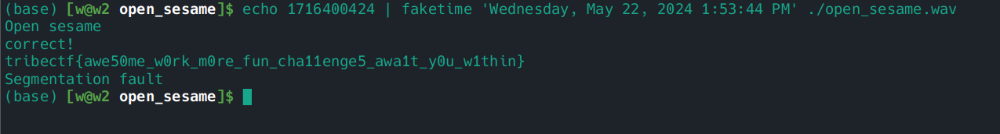

# Open Sesame

We are given the [open_sesame.wav](./open_sesame.wav).
The CTF setters have given us some music to listen to!

## Part 1 - Facing the music

Surely this is just a normal wav file with nothing special to it, let's check out its info with
```bash
ffprobe -hide_banner open_sesame.wav
```


... :(

I can't believe the setters would do this to us! Let's see what's actually going on with a hex dump:


Looks like we should actually be expecting an ELF-formatted binary.
That means that we should be able to open it up in https://dogbolt.org/ and take a look.

## Part 2 - Do you happen to have the time?

In our online decompiler, we can see the logic used in the program's `main` function:


I particularly like `Hex-Rays`'s decompilation here, very clean, and it even gives us some automatic variable names!
Removing the comments that aren't as necessary for us and adding some line breaks:

```c
int __fastcall main(int argc, const char **argv, const char **envp)
{
    unsigned int v3; 
    __int64 v5;
    time_t timer;
    unsigned __int64 v7;

    v7 = __readfsqword(0x28u);
    puts("Open sesame");
    enc();
    
    __isoc99_scanf("%lu", &v5);
    time(&timer);
    if ( v5 == timer && timer == 1716400424 ) {
        puts("correct!");
        makeKey(timer);
    } else {
        puts("nice try bozo");
    }
    
    puts("Segmentation fault");
    v3 = getppid();
    ptrace(PTRACE_KILL, v3, 0LL, 0LL);
    return 0;
}
```

We could attack this method a handful of ways (i.e., looking further into `makeKey` and `enc`/`dec`),
but what immediately stood out to me is that the program seems to depend on being run at a particular time.

`time(&timer)` is called to retrieve the UNIX timestamp, and then it is checked against `1716400424` before the key is given.
It also looks like we need to write that timestamp to `stdin` for the check to pass.

But wait, let's see what that timestamp is:


5 months ago! How are we supposed to get the program to succeed if it checks that the current time was 5 months ago?

## Part 3 - Time Travel

Fortunately, on UNIX-like systems, we have the `faketime` utility!
This is a utility that intercepts system calls which fetch the current time,
and return an arbitrary time of our choosing instead.

> Note: `faketime`'s translation of the date back to a UNIX timestamp happens to be timezone-sensitive, we'll choose the translation in our time zone.

Finally, we just pipe in the expected input, and run the binary!



Nice, it looks like that's worked! Our key is `tribectf{awe50me_w0rk_m0re_fun_cha11enge5_awa1t_y0u_w1thin}`. Pwned/QED


